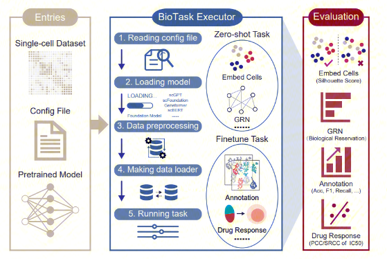

# BioLLM

This is the official github repository for **BioLLM: A Standardized Framework for Integrating and Benchmarking Single-Cell Foundation Models.**

[](https://www.cell.com/patterns/fulltext/S2666-3899(25)00174-6) &nbsp;
[](https://biollm.readthedocs.io/en/latest/) &nbsp;


# Introduction 
The application and evaluation of foundational models (scFMs) present significant challenges stemming from the heterogeneity of architectural frameworks and coding standards. To address these issues, we introduce BioLLM, a standardized framework designed to facilitate the integration and application of scFMs in single-cell RNA sequencing analyses. BioLLM provides a cohesive interface, enabling researchers to access various scFMs regardless of architectural differences or coding standards. With standardized APIs and comprehensive documentation, BioLLM streamlines model switching and comparative analyses, while incorporating best practices for consistent model evaluation.




## Installation


From source:
```bash
git clone https://github.com/BGIResearch/BioLLM.git
cd BioLLM
python ./setup.py
```


**Note**: The `flash-attn` dependency usually requires specific GPU and CUDA version which was used for scGPT. If you encounter any issues, please refer to the [flash-attn](https://github.com/HazyResearch/flash-attention/tree/main) repository for installation instructions. We recommend using CUDA 11.7 and flash-attn<1.0.5 due to various issues reported about installing new versions of flash-attn.


## Discussion 
Please use GitHub [issues](https://github.com/BGIResearch/BioLLM/issues) tracker for reports and discussions of:
 - Bug reports
 - Document and data issues
 - Feature requirements
 - ...

## Citing BioLLM
@article{qiu2025biollm,
  doi     = {10.1016/j.patter.2025.101326},
  title   = {BioLLM: A standardized framework for integrating and benchmarking single-cell foundation models},
  author  = {Qiu, Ping and others},
  journal = {Patterns},
  volume  = {6},
  number  = {8},
  year    = {2025}
}


## Contribution 
We warmly invite contributions to biollm. If you have suggestions or bug fixes, please feel free to submit a pull request. Additionally, we are open to any issues you might encounter while utilizing biollm.
