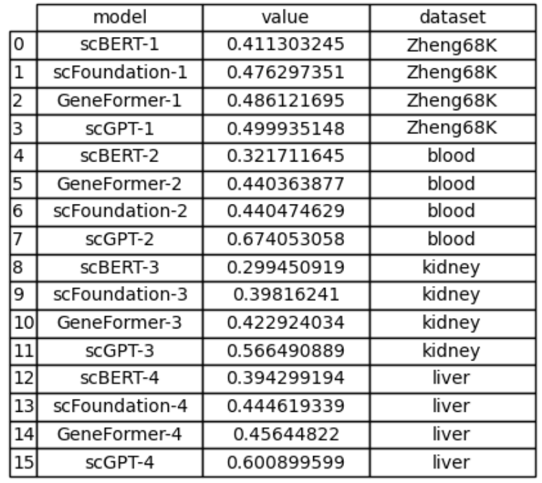
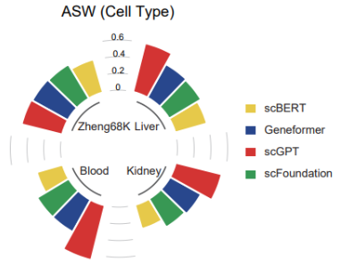
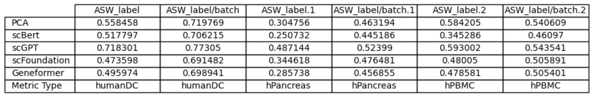
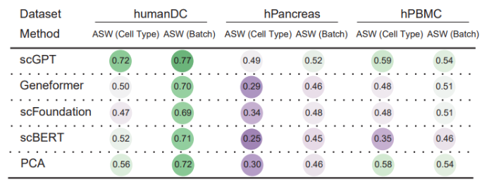

# BioLLM: Cell Embedding Generation from scFM Models (Zero-Shot)  Task

This documentation explains how to generate cell embeddings from various single-cell foundational models (scFMs) using BioLLM. The models supported include **scGPT**, **Geneformer**, **scFoundation**, and **scBERT**. The following sections describe the setup, configuration, and procedures for generating cell embeddings from each model.

## Prerequisites

Before proceeding, ensure that you have the following installed:

- Python 3.6+
- Required dependencies (use `pip install -r requirements.txt`)

## Overview of Models

BioLLM supports four major foundational models for generating cell embeddings from single-cell RNA-seq data:

- **scGPT**
- **Geneformer**
- **scFoundation**
- **scBERT**

For each model, preprocessing steps and configuration files are provided to ensure the best performance. Below are the details on how to use each model for zero-shot generation of cell embeddings.

## Preprocessing and Embedding Generation

For Geneformer and scGPT, which support input sequence lengths of 2048 and 1200 respectively, we selected 3000 highly variable genes as input features. The other two foundational models, **scBERT** and **scFoundation**, utilized full-length gene sequences without feature selection. 

### Preprocessing Details:
- **scGPT** and **Geneformer**: Input features are selected from the 3000 highly variable genes.
- **scBERT** and **scFoundation**: All gene sequences are used, without feature selection.

The preprocessing steps align with each model's pretraining conditions to ensure optimal performance.

### Normalization:
- **scGPT**, **scBERT**, and **scFoundation**: Log1p transformation of the gene expression data is required.
- **Geneformer**: Raw counts are used without normalization.

### Embedding Generation Methods:
- **scGPT**: The cell embedding is derived from the CLS token embedding.
- **Geneformer**: Embeddings are extracted using the `mean_nonpadding_embs` function, which computes the mean of non-padded token embeddings.
- **scFoundation**: Final cell embeddings are generated through max pooling applied to the token embeddings.
- **scBERT**: Three methods are available for generating cell embeddings: CLS, mean, and sum. The CLS method uses the CLS token embedding, while mean and sum pooling methods aggregate the token embeddings produced by the model's encoder.

This ensures that each model's strengths are effectively leveraged for generating accurate cellular representations for downstream analysis.

## Usage Instructions

### 1. Get the cell embedding from scFM models(zero-shot)
#### scGPT:

```python
from biollm.tasks.cell_embedding import CellEmbedding
config_file = './config/embeddings/cell_emb/scgpt/liver.toml'
obj = CellEmbedding(config_file)
obj.run()
```

#### Geneformer:

```python
from biollm.tasks.cell_embedding import CellEmbedding
config_file = './config/embeddings/cell_emb/gf/liver.toml'
obj = CellEmbedding(config_file)
obj.run()
```

#### scFoundation:

```python
from biollm.tasks.cell_embedding import CellEmbedding
config_file = './config/embeddings/cell_emb/scf/liver.toml'
obj = CellEmbedding(config_file)
obj.run()
```

#### scBERT:

```python
from biollm.tasks.cell_embedding import CellEmbedding
config_file = './config/embeddings/cell_emb/scbert/liver.toml'
obj = CellEmbedding(config_file)
obj.run()
```

Note: The config directory can be found in the biollm/config. 

### 2. Evaluation
```python
from sklearn.metrics import silhouette_score
import os
from collections import defaultdict
import scanpy as sc
import pickle
import numpy as np
import pandas as pd

def cal_aws(cell_emb, label):
    asw = silhouette_score(cell_emb, label)
    # return asw
    asw = (asw + 1)/2
    return asw

scores = defaultdict(list)
models = ['scBert', 'scGPT', 'scFoundation', 'Geneformer']
output_dir = './output'
dataset_for_test = './liver.h5ad'

pkl_map = {'scBert': 'scbert_cell_emb.pkl', 'scGPT': 'scg_cell_emb.pkl', 'scFoundation': 'scf_cell_emb.pkl', 'Geneformer': 'gf_cell_emb.pkl'}
adata = sc.read_h5ad(dataset_for_test)
label_key = 'celltype' if 'celltype' in adata.obs.columns else 'CellType' #
for model in ['scBert', 'scGPT', 'scFoundation', 'Geneformer']:
    with open(os.path.join(output_dir, pkl_map[model]), 'rb') as f: 
        adata.obsm['model'] = pickle.load(f)
        if np.isnan(adata.obsm['model']).sum() > 0:
            print('cell emb has nan value. ', model)
            adata.obsm['model'][np.isnan(adata.obsm['model'])] = 0
    
        aws = cal_aws(adata.obsm['model'], adata.obs[label_key].cat.codes.values) # In addition to cell type, the ASW score can also be calculated based on batches.
        print(model, aws)
        scores['data'].append(dataset_for_test.split('/')[-1].split('.h5ad')[0])
        scores['model'].append(model)
        scores['aws'].append(aws)
df = pd.DataFrame(scores)
df.to_csv('./zero-shot_cellemb_aws.csv', index=False)
```

### 03 Visualization
```python
import matplotlib.pyplot as plt
import numpy as np
import pandas as pd

# Here are the model performances on four datasets: 'Zheng68K', 'blood', 'kidney', and 'liver'
df = pd.read_csv('./zero-shot_cellemb_aws.csv')

# Custom function to convert radians and add labels
def get_label_rotation(angle, offset):
    rotation = np.rad2deg(angle + offset)
    if angle <= np.pi:
        alignment = "right"
        rotation += 180
    else:
        alignment = "left"
    return rotation, alignment

def add_labels(angles, values, labels, offset, ax):
    padding = 0.2
    for angle, value, label in zip(angles, values, labels):
        rotation, alignment = get_label_rotation(angle, offset)
        ax.text(
            x=angle, y=value + padding, s=label, 
            ha=alignment, va="center", rotation=rotation, 
            rotation_mode="anchor"
        )

GROUP = df["dataset"].values
GROUPS_SIZE = [len(i[1]) for i in df.groupby("dataset")]
COLORS = ['#F4D72D', '#1F9A4C', '#1D3D8F', '#DF2723'] * 4  # Define the color corresponding to the model

VALUES = df["value"].values
LABELS = df["model"].values

OFFSET = np.pi / 2
PAD = 2
ANGLES_N = len(VALUES) + PAD * len(np.unique(GROUP))
ANGLES = np.linspace(0, 2 * np.pi, num=ANGLES_N, endpoint=False)
WIDTH = (2 * np.pi) / len(ANGLES)

# Get index
offset = 0
IDXS = []
for size in GROUPS_SIZE:
    IDXS += list(range(offset + PAD, offset + size + PAD))
    offset += size + PAD

# Initialize polar coordinate graph
fig, ax = plt.subplots(figsize=(10, 8), subplot_kw={"projection": "polar"})
ax.set_theta_offset(OFFSET)
ax.set_ylim(-0.7, 1)

ax.set_frame_on(False)
ax.xaxis.grid(False)
ax.yaxis.grid(False)
ax.set_xticks([])
ax.set_yticks([])

# Add bar chart
ax.bar(ANGLES[IDXS], VALUES, width=WIDTH, color=COLORS, edgecolor="white", linewidth=2)

# Add labels
add_labels(ANGLES[IDXS], VALUES, LABELS, OFFSET, ax)

# Add group tags
offset = 0
for group, size in zip(["Zheng68K", "blood", "kidney", "liver"], GROUPS_SIZE):
    x1 = np.linspace(ANGLES[offset + PAD], ANGLES[offset + size + PAD - 1], num=50)
    ax.plot(x1, [-0.1] * 50, color="#333333")
    
    ax.text(
        np.mean(x1), -0.2, group, color="#333333", fontsize=14, 
        fontweight="bold", ha="center", va="center"
    )
    
    x2 = np.linspace(ANGLES[offset], ANGLES[offset + PAD - 1], num=50)
    ax.plot(x2, [0] * 50, color="#bebebe", lw=0.8)
    ax.plot(x2, [0.2] * 50, color="#bebebe", lw=0.8)
    ax.plot(x2, [0.4] * 50, color="#bebebe", lw=0.8)
    ax.plot(x2, [0.6] * 50, color="#bebebe", lw=0.8)
    
    offset += size + PAD

plt.tight_layout()
plt.show()
```
#### Sample Data


#### Figure

```python
import pandas as pd
import matplotlib.pyplot as plt
from plottable import ColumnDefinition, Table
from plottable.plots import bar
import matplotlib
from typing import Optional

# Here are the model performances on three datasets: 'humanDC', 'hPancreas', and 'hPBMC'.
df1 = pd.read_csv('./zero-shot_cellemb_aws_celltype.csv') # asw score for clusters based on cell type
df2 = pd.read_csv('./zero-shot_cellemb_aws_batch.csv') # asw score for clusters based on batch
merged_df = pd.merge(df1, df2, on=['model', 'datasets'])
pivot_df = merged_df.pivot(index='model', columns='datasets', values=['aws_celltype', 'aws_batch'])
pivot_df.columns = [f'{i}_{j}' for i, j in pivot_df.columns]
metric_type_row = pd.DataFrame(
    [['aws_celltype' if 'aws_celltype' in col else 'aws_batch' for col in pivot_df.columns]],
    columns=pivot_df.columns,
    index=['Metric Type']
)
df = pd.concat([metric_type_row, pivot_df])
df = df.reset_index().rename(columns={'index': 'model'})
df.set_index('model', inplace=True)

# Define the plotting function
def plot_results_table(df, show: bool = True, save_path: Optional[str] = None) -> Table:
    # Remove the "Metric Type" row and calculate the mean of each row for sorting
    plot_df = df.drop("Metric Type", axis=0)
    plot_df["mean_value"] = plot_df.mean(axis=1)  # Calculate the mean of each row
    plot_df = plot_df.sort_values(by="mean_value", ascending=True)  # Sort by mean in ascending order
    plot_df = plot_df.drop(columns=["mean_value"])  # Drop the mean column

    num_embeds = plot_df.shape[0]
    plot_df["Dataset"] = plot_df.index

    # Identify columns for "Macro F1" scores and other metrics
    score_cols = df.columns[df.loc["Metric Type"] == "Macro F1"]
    other_cols = df.columns[df.loc["Metric Type"] != "Macro F1"]
    column_definitions = [
        ColumnDefinition("Dataset", width=1.5, textprops={"ha": "left", "weight": "bold"}),  
    ]

    # Define column properties for non-score columns
    column_definitions += [
        ColumnDefinition(
            col,
            title=col.split('.')[0],
            width=1,
            textprops={
                "ha": "center",
                "bbox": {"boxstyle": "circle", "pad": 0.25},
            },
            cmap=matplotlib.cm.PRGn,
            group=df.loc["Metric Type", col],
            formatter="{:.2f}",
        )
        for i, col in enumerate(other_cols)
    ]

    # Define column properties for score columns (using bar plots)
    column_definitions += [
        ColumnDefinition(
            col,
            width=1,
            title=col.split('.')[0],
            plot_fn=bar,
            plot_kw={
                "cmap": matplotlib.cm.YlGnBu,
                "plot_bg_bar": False,
                "annotate": True,
                "height": 0.9,
                "formatter": "{:.2f}",
            },
            group=df.loc["Metric Type", col],
            border="left" if i == 0 else None,
        )
        for i, col in enumerate(score_cols)
    ]
    
    # Set font type for PDF output
    plt.rcParams['pdf.fonttype'] = 42
    
    # Create the table plot
    with matplotlib.rc_context({"svg.fonttype": "none"}):
        fig, ax = plt.subplots(figsize=(len(df.columns) * 2, 3 + 0.35 * num_embeds))
        ax.patch.set_facecolor("white")
        tab = Table(
            plot_df,
            cell_kw={
                "linewidth": 0,
                "edgecolor": "k",
            },
            column_definitions=column_definitions,
            ax=ax,
            row_dividers=True,
            footer_divider=True,
            textprops={"fontsize": 10, "ha": "center"},
            row_divider_kw={"linewidth": 1, "linestyle": (0, (1, 5))},
            col_label_divider_kw={"linewidth": 1, "linestyle": "-"},
            column_border_kw={"linewidth": 1, "linestyle": "-"},
            index_col="Dataset",
        ).autoset_fontcolors(colnames=plot_df.columns)
    
    # Display the plot if required
    if show:
        plt.show()
    
    # Save the plot if a save path is provided
    if save_path is not None:
        fig.savefig(save_path, facecolor=ax.get_facecolor(), dpi=300)
    return tab

# Call the function to plot the table
plot_results_table(df, show=True)

```
#### Sample Data


#### Figure

## Config Directory

The configuration files for each model can be found in the `biollm/docs/` directory. Ensure that the path and parameters are adjusted based on your dataset.

## Conclusion

This guide demonstrates how to use BioLLM to generate cell embeddings from various foundational models. The preprocessing steps are tailored to each model’s requirements to ensure optimal performance. By following the instructions and adjusting the configurations, you can effectively generate high-quality cell embeddings for downstream analysis.
