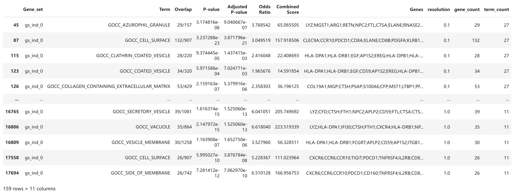
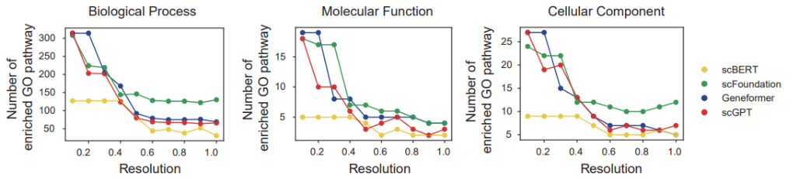

#  BioLLM: Gene Regulatory Network (GRN) Task

This document outlines the process of conducting Gene Regulatory Network (GRN) analysis using foundational models integrated into the **BioLLM** framework. The models used in this analysis include **Geneformer**, **scBERT**, **scGPT**, and **scFoundation**.

## Preprocessing and Input Dataset

The **Immune_ALL_human** dataset was used as the input for the GRN analysis. The following preprocessing steps were applied to ensure data quality and relevance:

1. **Gene Filtering**: Genes with fewer than 3 counts were excluded.
2. **Feature Selection**: The dataset was subset to the top 1200 highly variable genes.

Once preprocessed, the dataset was passed through the foundational models to generate **gene embeddings**.

## Embedding Generation and Network Construction

For each foundational model, embeddings are generated based on the processed dataset. After the embeddings are computed, Euclidean distance is calculated between gene pairs to construct an **adjacency matrix**. This matrix represents the relationships between genes, with each element indicating the degree of similarity between gene pairs. The adjacency matrix is then used to infer potential regulatory relationships, forming the basis of the **Gene Regulatory Network** (GRN), where nodes represent genes and edges represent regulatory connections.

## GRN Analysis with Different Foundational Models

Below are the steps and code examples for generating gene embeddings using **Geneformer**, **scBERT**, **scGPT**, and **scFoundation** and conducting GRN analysis.

### 1. Get the gene expression embedding from scFM models (zero-shot)

#### Geneformer:

```python
from biollm.tasks.grn_task import GrnTask
config_file = './config/embeddings/grn/geneformer_GB.toml'
obj = GrnTask(config_file)
obj.run()
```

#### scBERT:

```python
from biollm.tasks.grn_task import GrnTask
config_file = './config/embeddings/grn/scbert_GB.toml'
obj = GrnTask(config_file)
obj.run()
```

#### scGPT:

```python
from biollm.tasks.grn_task import GrnTask
config_file = './config/embeddings/grn/scgpt_GB.toml'
obj = GrnTask(config_file)
obj.run()
```

#### scFoundation:

```python
from biollm.tasks.grn_task import GrnTask
config_file = './config/embeddings/grn/scfoundation_GB.toml'
obj = GrnTask(config_file)
obj.run()

```

Note: You can find the configs in biollm/config.

### 2 Visualization

```python
import pandas as pd
import matplotlib.pyplot as plt
from matplotlib.lines import Line2D
import glob
import os

def count_genes(gene_string):
    if pd.isna(gene_string):
        return 0
    return len(gene_string.split(';'))

# Colors for models
colors = {
    'scbert': '#F4D72D',
    'scfoundation': '#1F9A4C',
    'geneformer': '#1D3D8F',
    'scgpt': '#DF2723'
}

# Store the enrichment results of the GOBP in a folder. The same applies to the enrichment results of GO_MF and GO_CC
file_paths = glob.glob(r'../GO_data/results/GOBP/*.csv')

# Initialize a dictionary to hold data for each model
model_data = {}

# Load data for each model
for file_path in file_paths:
    file_name = os.path.splitext(os.path.basename(file_path))[0]  # Extract model name from file name
    model_name = file_name.split('_')[0]
    df = pd.read_csv(file_path)
    # Filter data based on the adjusted p-value and gene count
    df_filtered = df[df['Adjusted P-value'] < 0.01]
    df_filtered['gene_count'] = df_filtered['Genes'].apply(count_genes)
    df_filtered = df_filtered[df_filtered['gene_count'] > 25]
    # Store the filtered data
    model_data[model_name] = df_filtered

# plotting
fig, ax = plt.subplots(figsize=(6, 3))

for model, df in model_data.items():
    df['term_count'] = df.groupby('resolution')['Term'].transform('count')
    resolution_data = df.groupby('resolution').agg(
        total_term_count=('Term', 'nunique'),
        total_gene_count=('Genes', 'size')
    ).reset_index()
    ax.plot(resolution_data['resolution'], resolution_data['total_term_count'], 
            color=colors[model], alpha=1, label=model, linewidth=2.5)
    ax.scatter(resolution_data['resolution'], resolution_data['total_term_count'],  
               s=30,  # bubble size
               color=colors[model], alpha=1, edgecolors='none', label=model)

ax.set_title(f'Biological Process') # Based on the data used for plotting, modify the title to the corresponding Molecular Function or Cellualr Component
ax.set_xlabel('Resolution')
ax.set_ylabel('Number of enriched GO pathway')

legend_elements_color = [Line2D([0], [0], marker='o', color='w', label=model,
                                markerfacecolor=color, markersize=10) for model, color in colors.items()]
legend_color = ax.legend(handles=legend_elements_color, loc='upper right', bbox_to_anchor=(1.5, 0.7),
                         title="Model Colors", frameon=False)

plt.tight_layout()
plt.show()
```
#### Sample Data

#### Figure

## Configurations

The configuration files can be found in the `biollm/docs/` directory. Ensure that paths, dataset details, and parameters are set correctly before running the code.

## Conclusion

This guide demonstrated how to conduct **Gene Regulatory Network (GRN)** analysis using various foundational models within the BioLLM framework. The process involves generating gene embeddings from a preprocessed dataset, calculating Euclidean distances between genes, and constructing an adjacency matrix that serves as the foundation for building the GRN. 

By using the different models, such as **Geneformer**, **scBERT**, **scGPT**, and **scFoundation**, you can analyze gene interactions and construct an inferred regulatory network to explore gene relationships within a given biological context.
