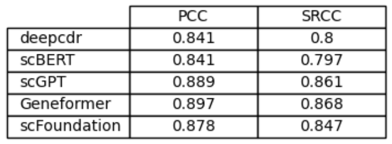
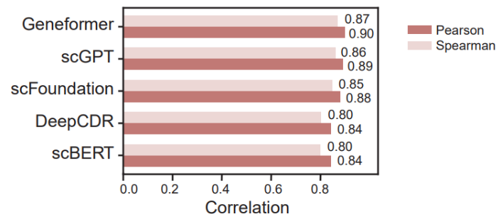

## BioLLM: DrugSensitivity Task

This document explains the implementation of the `DrugTask` class for drug annotation tasks. It covers the major steps involved in training and evaluating models using various available options like `scGPT`, `scBERT`, `scFoundation`, `Geneformer`, and others. The following sections describe the main features, functions, and usage of the `DrugTask` class in detail.

### Table of Contents
1. [Overview](#1-overview)
2. [Model Selection](#2-model-selection)
3. [How to Use](#3-how-to-use)
4. [Functionality Details](#4-functionality-details)
5. [Running the DrugTask](#5-running-the-drugtask)

### 1. Overview
The `DrugSensitivity` is designed to facilitate drug annotation through data processing, model training, and evaluation. It supports multiple models including `scGPT`, `scBERT`, `scFoundation`, and `Geneformer`. The workflow includes:

- Preprocessing input data
- Performing model pretraining (if applicable)
- Extracting features
- Training the model
- Testing and evaluation

### 2. Model Selection
The implementation allows you to use several models to perform drug annotation. Here is a list of models available:

- **scGPT**: A generative pre-trained transformer specialized for single-cell data.
- **scBERT**: A BERT-like model for single-cell annotation.
- **scFoundation**: A foundational model for single-cell data analysis.
- **Geneformer**: A transformer model tailored for gene-level tasks.


To select a specific model, change the value of `model_select` in the `__main__` block of the code:

```python
model_select = 'scgpt'  # Options: 'scgpt', 'scbert', 'scfoundation', 'geneformer'
```

### 3. How to Use
To use the `DrugSensitivity` class, follow these steps:

1. **Configure Model Selection**: Choose the appropriate model by setting the `model_select` variable.
2. **Run the Task**: Execute the script to start the training and evaluation process.

### 4. Functionality Details

#### Key Functions
- **`__init__`**: Initializes the `DrugTask` with the given configuration file, sets up necessary device information, and prepares initial settings.
- **`pretrain_inference()`**: Performs pretraining and generates embeddings for the gene expression features. Depending on the model, different preprocessing and embedding methods are applied.
- **`train()`**: Handles the training process for the selected model. Includes early stopping to prevent overfitting.
- **`test()`**: Evaluates the model on the validation dataset and calculates various metrics such as Pearson Correlation Coefficient (PCC) and Spearman rank correlation.
- **`run()`**: Main function that orchestrates data processing, model pretraining, training, and evaluation.

#### Pretraining and Training
- The pretraining stage involves processing the gene expression features (`gexpr_feature`) using the selected model. For some models like `Geneformer`, additional preprocessing steps are applied.
- During training, the model is trained for several epochs, and metrics are recorded to select the best-performing model.

#### Early Stopping
The training function implements early stopping if there is no improvement in PCC for `patience` consecutive epochs. This helps prevent overfitting and reduces computational costs.

### 5. Running the DrugTask
The `DrugTask` class can be run directly from the command line or integrated into a larger system. Use the following command:

```python
from biollm.tasks.drug_sensitivity import DrugSensitivity

config_file = './config/embeddings/drug/gf.toml'
obj = DrugSensitivity(config_file)
obj.run()
```

Replace `./config/embeddings/drug/gf.toml` with the appropriate path to your configuration files.

### Example Configurations
Configurations for each model are available in the `biollm/config/drug/` directory. Adjust the configuration file to specify paths to the input and output data, model parameters, and other settings as required.

#### Notes
- Ensure the appropriate configuration file is provided.
- Customize paths to the configuration and data directories based on your environment.

#### Sample Data


#### Figure
